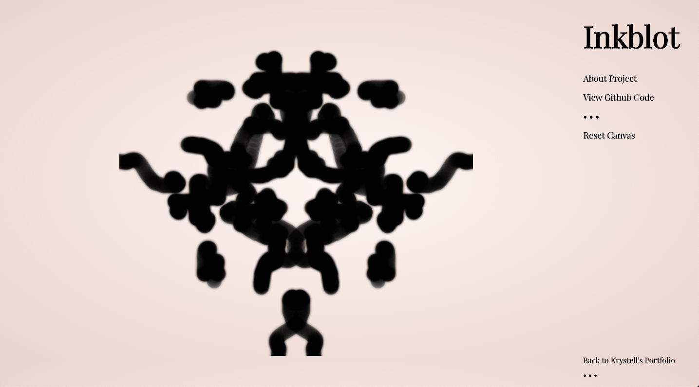

# Inkblot 
Inspired by the Rorschach Test, Inkblot uses HTML5's canvas API to create fluid illustrations with bilateral symmetry.

[Visit website here](https://krystellbarraza.github.io/Iceland_Travel/)

## Screenshots

## Technologies
* HTML5, CSS
* JavaScript

## Status
Project Status: Finished.

## Inspiration
Inkblot is inspired by the Rorschach Test.
The Rorschach test was created by Swiss psychologist Hermann Rorschach to examine a person's personality and emotional functioning by having them describe what they see in inkblots. While the validitiy of test has been questioned by some modern psychologists, Rorschach's abstract illustrations continue to fascinate people to this day.

## Contact
Made by [@KrystellBarraza](https://www.krystellbarraza.com).